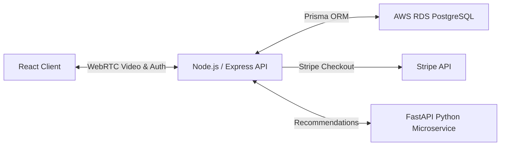

# 💡 IntelliDART: STEM Online Tutor Marketplace & Career Guidance Platform
      

## 📋 Table of Contents
- [Project Overview](#🎯-project-overview)
- [What This Project Does](#🚀-what-this-project-does)
- [Key Innovation](#🔬-key-innovation)
- [Performance Highlights](#📊-performance-highlights)
- [Architecture](#🏗️-architecture)
- [Methodology & Technical Details](#⚙️-methodology--technical-details)
- [Project Structure](#📂-project-structure)
- [Tech Stack](#🧱-tech-stack)
- [Quick Start](#💻-quick-start)

---

## 🎯 Project Overview
IntelliDART is a multi-tenant tutor marketplace connecting STEM students with tutors. It features JWT-based role authentication, a Prisma ORM schema managing 7 relational models on an AWS RDS PostgreSQL database, and integrated WebRTC peer-to-peer video streaming and Stripe API payment gateways.

---

## 🚀 What This Project Does
* **The Challenge:** Lack of standardized online platforms connecting STEM students with vetted tutors while providing automated career tracking and real-time interactive classrooms.
* **Our Solution:** A scalable multi-tenant tutoring platform with robust database schemas, secure payment flows, and peer-to-peer WebRTC video classrooms.

---

## 🔬 Key Innovation
| Feature | Traditional Approach ❌ | IntelliDART Solution ✅ | Benefit |
|---------|------------------------|-------------------------|---------|
| **Data Schema** | Single-table collections without strict type checks | **Prisma ORM schema with 7 relational models** | Type-safe queries, migration control |
| **Classroom** | Redirection to Zoom/Meet links | **Embedded WebRTC WebRTC peer-to-peer connections** | Native classroom experience without external accounts |
| **Career Progress** | Manual text diaries or logs | **CareerMilestone & KnowledgeGraph models** | Structured learning and skill-gap tracking |

---

## 📊 Performance Highlights
- ✅ **7 relational models** deployed on AWS RDS.
- ✅ **JWT role onboarding** separating student, tutor, and admin interfaces.
- ✅ **Stripe API integration** simulating instant bookings and credit holding.

---

## 🏗️ Architecture


---

## ⚙️ Methodology & Technical Details
### Multitenancy and Prisma Schema Layout
IntelliDART enforces role-based separation using Prisma schema models. A single `User` model links to separate `Student` and `Tutor` profiles, ensuring that specific metadata (e.g. hourly rate, grades, schedules) are isolated.
The database comprises 7 models:
- `User`: Base authentication account (name, email, password hash, role).
- `Student`: Linked to users, tracks class levels and payment accounts.
- `Tutor`: Tracks hourly rates, verified subjects, and average reviews.
- `Session`: Tutoring schedule bookings linking student, tutor, and status.
- `Report`: GenAI performance summaries issued after sessions.
- `KnowledgeGraph`: Tracks skill-acquisition trees for students.
- `CareerMilestone`: Chronological goals for academic progression.

### WebRTC Classroom Architecture
When a session starts, the backend initializes a WebRTC signaling route. The student and tutor client apps complete a handshake (SDP offer/answer exchange) through Socket.IO and establish a direct Peer-to-Peer connection. Audio, video, and whiteboards are synced directly between browsers to ensure sub-100ms latency.

### Stripe Billing Integration
Payments utilize the Stripe Node library to establish checkout sessions. When a student schedules a session, the backend calls Stripe to hold the funds. Upon successful tutor verification of session completion, a payout webhook is dispatched, automating earnings distribution.

---

## 📂 Project Structure
```
IntelliDART/
├── frontend/                 # React frontend application
├── backend/                  # Node.js/Express backend API
│   ├── src/controllers/      # Session and payment logic
│   └── prisma/schema.prisma  # Relational database models
├── ai-service/              # Python FastAPI AI microservice
└── database/                # Database migrations and schema
```

---

## 🧱 Tech Stack
- React.js with Material-UI and Redux state management
- Node.js & Express.js backend with TypeScript
- PostgreSQL database on AWS RDS via Prisma ORM
- FastAPI Python microservice for mock AI recommendations

---

## 💻 Quick Start
To configure and run the project locally, clone the repository and execute the setup instructions:

```bash
git clone https://github.com/Raghuram-sekar/IntelliDART.git
cd IntelliDART

# Execute local setup commands:
cd backend && npm install
cd ../frontend && npm install
npm run dev
```
