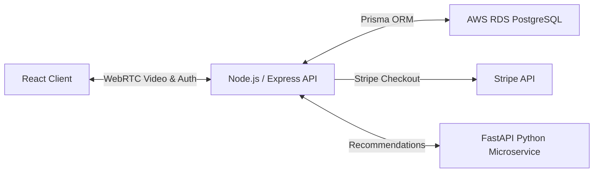

# IntelliDART STEM Tutor Marketplace
     

## Overview
IntelliDART is a multi-tenant tutor marketplace connecting STEM students with tutors. It features JWT-based role authentication, a Prisma ORM schema managing 7 relational models on an AWS RDS PostgreSQL database, and integrated WebRTC peer-to-peer video streaming and Stripe API payment gateways.

## System Architecture


## Features
- Role-based authorization (Student, Tutor, Admin) using JWT.
- Database schemas managed with Prisma ORM (7 relational tables: users, students, tutors, sessions, reports, knowledge_graphs, career_milestones).
- Session booking workflows with Stripe checkout simulation.
- Peer-to-peer live tutoring sessions using WebRTC.

## Tech Stack
- React.js with Material-UI and Redux state management
- Node.js & Express.js backend with TypeScript
- PostgreSQL database on AWS RDS via Prisma ORM
- FastAPI Python microservice for mock AI recommendations

## Getting Started
To configure and run the project locally, clone the repository and execute the setup instructions:

```bash
git clone https://github.com/Raghuram-sekar/IntelliDART.git
cd IntelliDART

# Execute local setup commands:
cd backend && npm install
cd ../frontend && npm install
npm run dev
```
